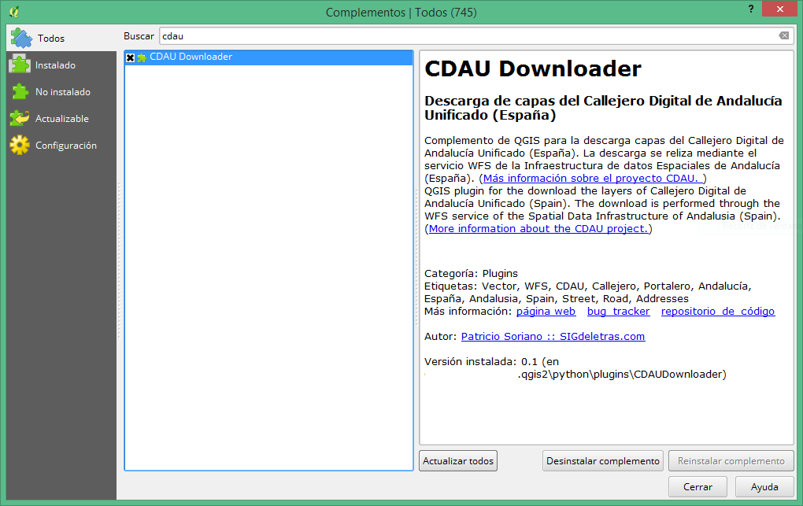

# CDAU Downloader 

Complemento de QGIS para la descarga capas del **Callejero Digital de Andalucía Unificado -  CDAU** (España). La descarga se reliza mediante el servicio WFS de la Infraestructura de datos Espaciales de Andalucía (España). (<a href='http://www.callejerodeandalucia.es/portal/web/cdau/'>Más información sobre el proyecto CDAU. </a>)

*QGIS plugin for the download the layers of Callejero Digital de Andalucía Unificado (Spain). The download is performed through the WFS service of the Spatial Data Infrastructure of Andalusia (Spain). (<a href='http://www.callejerodeandalucia.es/portal/web/cdau/'>More information about the CDAU project.</a>)*

Para más información puede consultarse la entrada en [SIGdeletras.com](http://www.sigdeletras.com/2017/plugin-de-qgis-para-descarga-de-datos-catastrales-inspire)

## Instalar plugin

El complemento puede ser instalado desde el menú <b>Complementos>Administrar e instalar complementos</b> de QGIS. Para localizar de forma rápida el complemento puede introducirse el término <i>"CDAU"</i> en la herramienta de búsqueda.

Igualmente, puede descargarse el archivo zip desde este repositorio y <b>descomprimirlo en la carpeta de plugins de QGIS</b> según el sistema operativo.

<ul>
<li>Windows: <i>c:\Users\username\.qgis2\python\plugins</i></li>
<li>Mac: <i>/Users/username/.qgis2/python/plugins</i></li>
<li>Linux: <i>/home/username/.qgis2/python/plugins</i></li>
</ul>
Donde tendremos que reemplazar “username” por nuestro usuario.

## Uso

Tras su instalación el plugin puede ser ejecutado desde la barra de herramientas o bien desde el menú <b>Complementos>Descarga Callejero CDAU</b> o bien <b>CDAU Downloader</b> si tenemos instalado QGIS en otro idioma.

Una vez ejecutado el complemento se debe <b>obligatoriamente</b>:
<ul>
<li>Seleccionar la provincia</li>
<li>Seleccionar el municipio</li>
<li>Indicar la ruta local de descarga</li>
<li>Indicar las capas a descargar: Viales, Tramos y/o Portalero/PK</li>
</ul>

El plugin hará las correspondientes peticiones al servicio [WFS](http://www.callejerodeandalucia.es/portal/web/cdau/descarga "Información sobre el servicio WFS") y descargará las capas en formato GeoJSON en la carpeta indicada. El sistema de referencia de las capas es ETRS89 (EPGS:4258).

Se ha incluído la posibilidad de **añadir simbología básica a las capas** *Vial* y *Portalero/PK". La simbología incluye:

* Capa **Vial**: Color negro y etiquetado por nombre de calle (campo *"nom_normalizado"*) visible a partir de la escala 1:5000

* Capa **Portal/PK**: Visibilidad de la capa capa a partir de la escala 1:3000, simbología puntal y etiquetado por número (campo *"num_por_desde"*)

<figure>
    
    <figcaption>Comparativa de carga de capas con o sin simbología. Roquetas de Mar (Almería). Base PNOA</figcaption>
</figure>

## Modelo de datos

Toda la información sobre el modelo de datos puede consultarse en el apartado [Proyecto](http://www.callejerodeandalucia.es/portal/web/cdau/origen) de la web del CDAU.

